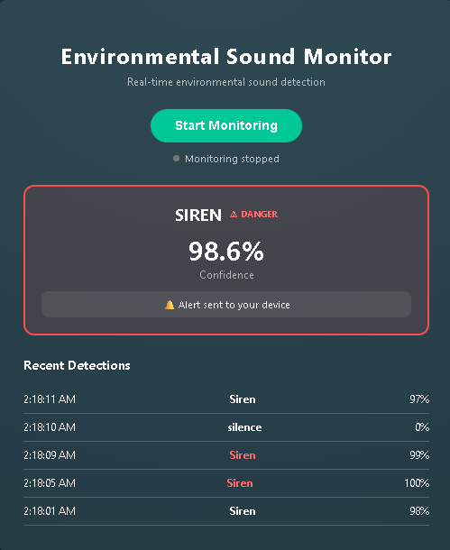
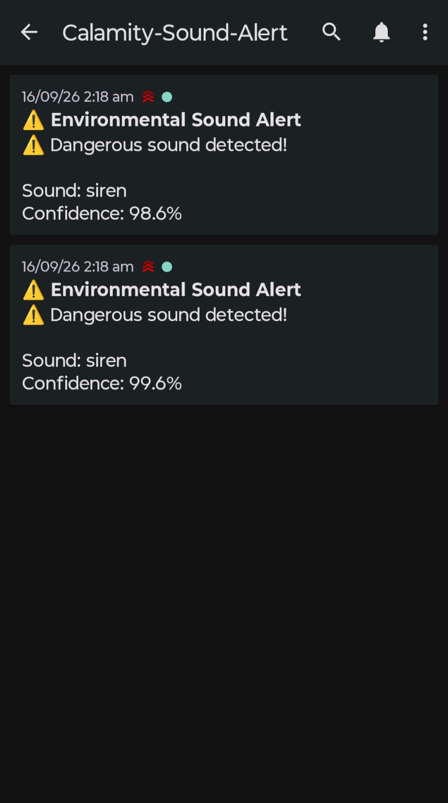
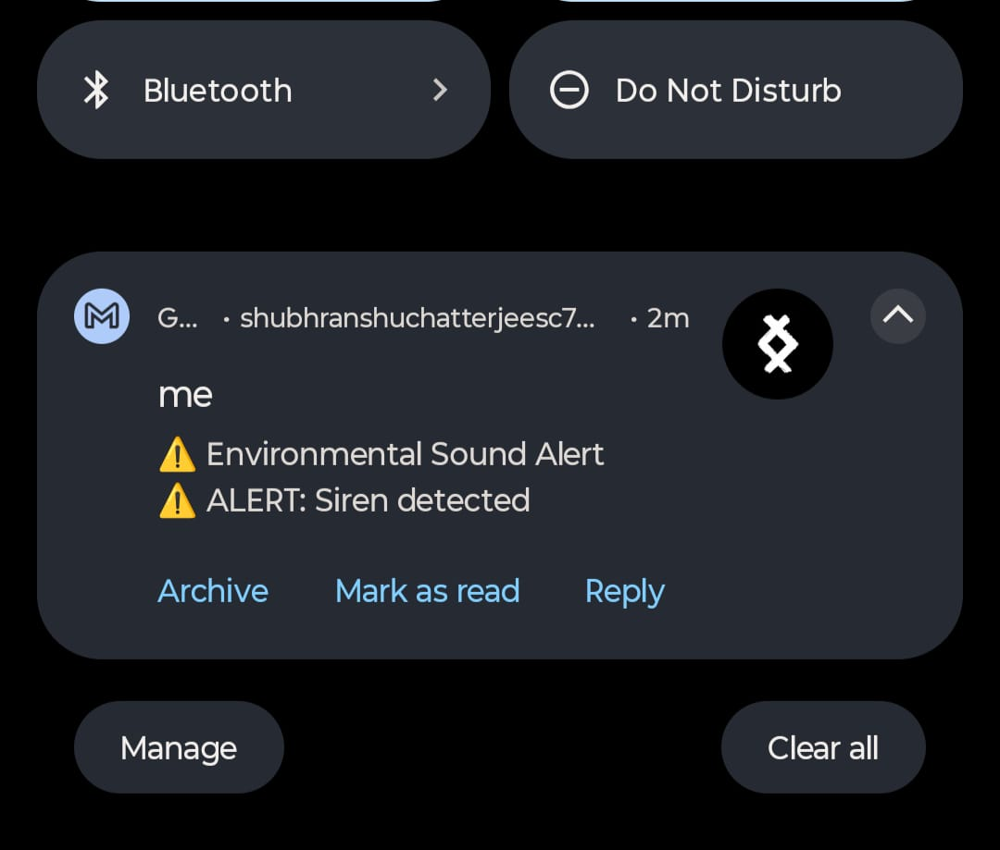

# Real-Time Environmental Sound Classification and Alert System
VISIT-APP:https://real-time-environmental-sound-class.vercel.app/


A full-stack real-time environmental sound monitoring system that listens to live microphone audio, classifies environmental sounds using a deep learning CRNN with Attention, visualizes the live waveform, maintains recent detection history, and sends push notifications when a dangerous sound is detected.

## Features

- Real-time microphone monitoring directly in the browser
- Rolling 5-second audio windows analyzed approximately every second
- Deep learning audio classification using a CRNN + Attention architecture
- Live waveform visualization using the Web Audio API and Canvas
- Recent prediction history with confidence scores
- Temporal smoothing to reduce false alerts
- Dangerous-sound detection using a confidence threshold
- Push notifications using [ntfy](https://ntfy.sh/) instead of email
- Monitoring state reset automatically when monitoring starts or stops
- Modern UI with visual danger indicators

## Demo

### Real-Time Detection



The dashboard displays the current prediction, confidence, danger status, and recent detections while the microphone is being monitored.

### Push Notification Alert



When a dangerous sound is confirmed, the backend sends a push notification to the configured ntfy topic.

### Device Notification



The alert can also appear as a normal device notification when notifications are enabled for the configured ntfy topic.

## Model Details

- **Dataset:** ESC-50 Environmental Sound Dataset
- **Architecture:**
  - CNN for spatial feature extraction from Mel Spectrograms
  - Bidirectional GRU for temporal modeling
  - Attention mechanism for temporal focus
- **Input:** 5-second audio clips at 22050 Hz
- **Output:** 50 environmental sound classes
- **Audio representation:** Log-Mel Spectrogram
- **Feature shape:** 216 × 128 × 1

### Model Pipeline

```text
Live Microphone Audio
        ↓
Rolling 5-Second Window
        ↓
Mel Spectrogram
        ↓
CNN Feature Extraction
        ↓
Bidirectional GRU
        ↓
Attention
        ↓
50-Class Softmax Prediction
        ↓
Temporal Smoothing
        ↓
Dangerous Sound Check
        ↓
ntfy Push Notification
```

## Dangerous Sounds Detected

The current backend treats the following ESC-50 labels as dangerous:

- Fire crackling
- Thunderstorm
- Strong wind
- Siren

An alert is generated only when the prediction passes the confidence threshold and the same dangerous class is consistently detected across multiple consecutive predictions.

## Alert Logic

The backend uses temporal smoothing to reduce one-off false positives.

An alert requires:

1. The predicted class is configured as dangerous.
2. Confidence is above the configured threshold (`0.75` by default).
3. The same dangerous class is detected consistently across consecutive prediction windows.
4. The system has not already alerted for the same ongoing dangerous event.

When monitoring is stopped and started again, the backend monitoring state is reset so a new dangerous event can trigger a fresh notification.

## Tech Stack

### Frontend

- React
- Web Audio API
- Canvas API
- JavaScript

### Backend

- FastAPI
- TensorFlow / Keras
- Librosa
- NumPy
- scikit-learn
- Python

### Notifications

- ntfy HTTP push notifications

## Project Structure

```text
project-root/
│
├── backend/
│   ├── model/
│   │   ├── esc50_crnn_model.h5
│   │   └── label_encoder.pkl
│   ├── app.py
│   ├── model_utils.py
│   ├── audio_utils.py
│   ├── alert.py
│   └── requirements.txt
│
├── frontend/
│   ├── public/
│   ├── src/
│   │   ├── App.js
│   │   ├── App.css
│   │   └── ...
│   ├── package.json
│   └── package-lock.json
│
├── README.md
└── .gitignore
```

> `.env` is intentionally excluded from Git. Configure it locally or through your deployment platform's environment variables.

## Setup Instructions

### 1. Clone the Repository

```bash
git clone https://github.com/Shubh3819/Real-Time-Environmental-Sound-Classification-and-Alert-System.git
cd Real-Time-Environmental-Sound-Classification-and-Alert-System
```

## Backend Setup

Open a terminal in the project root:

```bash
cd backend
```

Create/activate your Python environment if desired, then install dependencies:

```bash
pip install -r requirements.txt
```

### Configure ntfy

Create a `backend/.env` file:

```env
NTFY_SERVER=https://ntfy.sh
NTFY_TOPIC=Calamity-Sound-Alert
```

Subscribe to the same topic in the ntfy mobile/desktop app before testing notifications.

### Run the Backend

From the `backend` directory:

```bash
uvicorn app:app --reload
```

The API will be available at:

```text
http://127.0.0.1:8000
```

## Frontend Setup

Open another terminal:

```bash
cd frontend
npm install
npm start
```

The React application will normally open at:

```text
http://localhost:3000
```

Allow microphone access when the browser asks for permission.

## How It Works

1. The browser requests microphone access.
2. The Web Audio API continuously collects microphone samples.
3. The frontend maintains a rolling buffer containing the latest audio.
4. Once enough audio is available, the latest 5-second window is converted to WAV.
5. The WAV data is sent to the FastAPI `/predict` endpoint.
6. The backend converts the audio into the same Mel-Spectrogram representation used by the trained model.
7. The CRNN predicts one of the 50 ESC-50 classes.
8. Temporal smoothing confirms persistent predictions.
9. If a dangerous sound is confirmed, the backend sends an ntfy push notification.
10. Starting or stopping monitoring resets the backend monitoring state.

## API

### `POST /predict`

Accepts a WAV/audio file and returns the predicted class, confidence, danger status, and whether a notification was triggered.

Example response:

```json
{
  "label": "Siren",
  "raw_label": "siren",
  "confidence": 0.986,
  "dangerous": true,
  "alert_triggered": true
}
```

### `POST /reset-monitoring`

Resets the temporal prediction buffer and alert state for a new monitoring session.

## Important Notes

- The trained model files are required for inference.
- The model was trained for 5-second audio clips at 22050 Hz.
- Browser microphone access requires user permission.
- `.env`, `node_modules`, Python cache files, and personal files are excluded from Git.
- For deployment, the frontend API URL must be changed from the local backend URL to the deployed backend URL.
- The ntfy topic should be kept private/unpredictable or protected appropriately because public ntfy topics are accessible to anyone who knows the topic name.

## Deployment

The application is deployed using:

- **Frontend:** Vercel
- **Backend:** Render
- **Notifications:** ntfy

### Backend API

https://real-time-environmental-sound.onrender.com

The backend exposes the `/predict` and `/reset-monitoring` endpoints.

The Render service may spin down after periods of inactivity on the free tier, so the first request after inactivity may take longer.

### Frontend

The React frontend is deployed on Vercel and communicates with the deployed Render backend.

## Future Improvements

- Cloud deployment
- Docker support
- More robust production-scale streaming inference
- Multi-microphone support
- Custom model retraining interface
- Persistent detection analytics
- Authentication and protected notification topics
